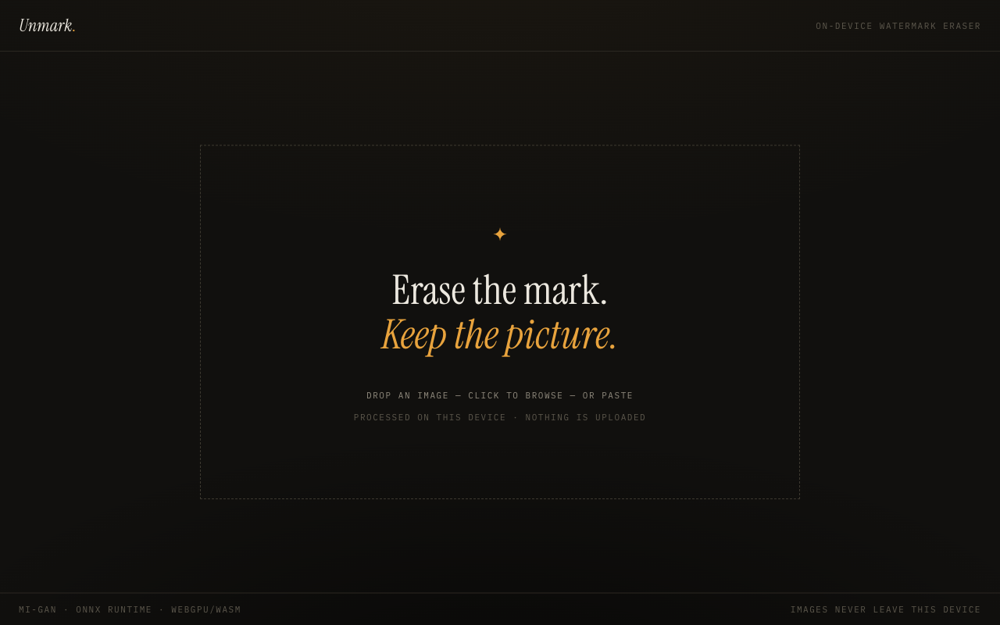

# Unmark

A minimal, on-device watermark eraser. Drop an image, brush over the mark (or
tap **✦ corner** for the standard AI-watermark position), hit **erase** —
the region is reconstructed by a generative inpainting model running entirely
in your browser. Nothing is ever uploaded.



## How it works

- **Model** — [MI-GAN](https://github.com/Picsart-AI-Research/MI-GAN)
  (`migan_pipeline_v2.onnx`, ~27 MB), a lightweight generative inpainting
  network. Self-hosted from `public/models/` and cached by the browser after
  the first visit.
- **Runtime** — [onnxruntime-web](https://onnxruntime.ai/), preferring the
  WebGPU execution provider and falling back to multithreaded WASM
  (cross-origin isolation headers are set in `next.config.ts` to enable
  threads). Runtime binaries are vendored into `public/ort/` by
  `scripts/copy-ort.mjs` on `npm install`.
- **Inference** — `src/lib/inpaint.ts` feeds the model raw `uint8` tensors
  (image `[1,3,H,W]` RGB + mask `[1,1,H,W]`, where mask `0` marks the hole)
  on a ~512 px crop centered on the mask, then composites only the masked
  pixels back into the original — full-resolution context, no global resampling.
- **UI** — Next.js App Router + Tailwind. One screen: canvas, brush,
  corner preset, undo, hold-to-compare, PNG export. Keyboard: `[` `]` brush
  size, `⌘Z` undo, hold `C` to compare.

## Develop

```bash
npm install   # also copies onnxruntime wasm files into public/ort/
npm run dev
```

`npm run build && npm run start` for a production build. Deploys to Vercel
with zero configuration; there is no server-side compute — the entire
pipeline is static assets plus client inference.

## Scope

Intended for images you have the rights to — e.g. cleaning the visible
sparkle from AI images you generated. It does not (and will not) touch
invisible provenance watermarks such as SynthID. Don't point it at other
people's copyrighted work.

## Credits

- [MI-GAN](https://github.com/Picsart-AI-Research/MI-GAN) — Picsart AI
  Research (ICCV 2023); ONNX export by
  [andraniksargsyan](https://huggingface.co/andraniksargsyan/migan).
- Tensor I/O conventions referenced from
  [inpaint-web](https://github.com/lxfater/inpaint-web) (Apache-2.0).
